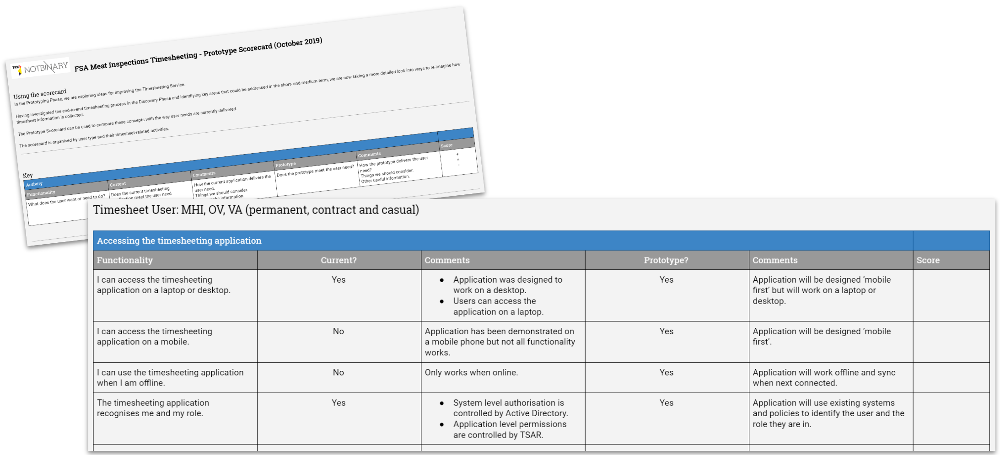

## Using prototype scorecards

In the Prototyping Phase, we are exploring ideas for improving the Timesheeting Service.

Having investigated the end-to-end timesheeting process in the Discovery Phase and identified key areas that could be addressed in the short- and medium-term, we are now taking a more detailed look into ways to re-imagine how timesheet information is collected.

The Prototype Scorecard can be used to compare these concepts with the way user needs are currently delivered. The scorecard is organised by user type and their timesheet-related activities.

## Timesheeting Scorecards

There are three scorecards covering the main user groups and reasons for using the timesheeting application:
- [MHI / OV](https://drive.google.com/open?id=11_Rgv0Pbef_EPMLajREnya0AdmamQmUw7Pd4y4DUAZ0): Accessing the timesheet application; submitting a timesheet; amending a timesheet. 
- [ITL / AVL](https://drive.google.com/open?id=1ByzZfUOOKsMOfdv5NZ6RF_l-HLRx5B7ICFUuZ3lrWSs): Accessing the timesheet application; submitting a timesheet; amending a timesheet; reviewing timesheets.
- [Finance (and non-Field Operations staff)](https://drive.google.com/open?id=1wuvZURlzZRL_DbUignDdvKPbBcHEkUN2YwXTsWxK_Mo): Accessing the timesheet application; submitting a timesheet; amending a timesheet; reviewing timesheets.

## Scoring

Scoring can be used to capture how people feel about the concepts in relation to the way things work now.
Score | Description
------- | -----
- | Not as good as the current application.
= | About the same as good as the current application.
+ | Better than the current application

We can then work to:
- revisit and improve any functions that score a minus rating.
- ensure all functions deliver the same or better outcome as the current application.
- fine-tune functions with a positive rating.

