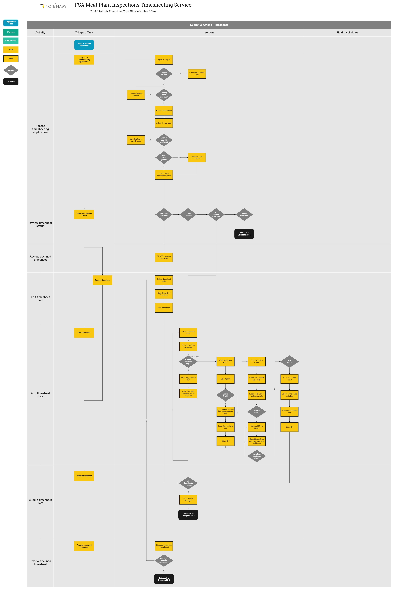

## Understand the service task flow
The service task flow shows an expanded view of the actions and outcomes for timesheeting activities. 

Following the intitial Discovery phase, which looked at the end to end timesheeting service, the task flow focusses on the activities selected for the Prototyping phase. The diagram shows the 'As-Is' tasks and steps as of October 2019.

It is annotated to highlight the business rules that inform and/or enable how tasks and steps are completed. 
It also includes notes on the knowledge required by users to complete tasks and steps.

The service taskflow can be used to compare prototype concepts with the current process.

DRAFT DIAGRAM

Click to open and zoom: [fsa_timesheeting_service_timesheet_submit_&_amend_as_is_task_flow_2019_10_09.pdf](uploads/fsa_timesheeting_service_timesheet_submit_&_amend_as_is_task_flow_2019_10_09.pdf)

