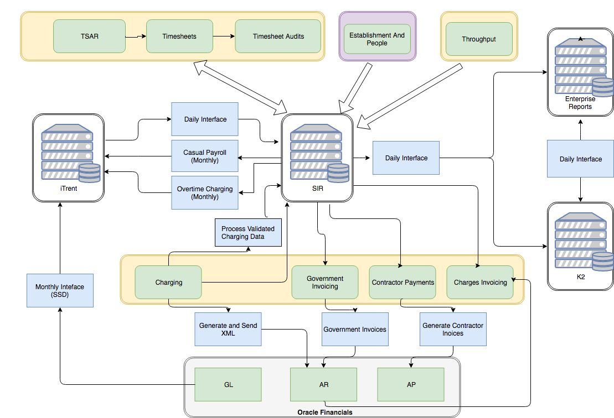

Whilst the timesheeting system is dedicated to supporting time recording for Plant Inspections, the service is supported by a number of FSA-wide common components.

## Single Information Repository (SIR)

SIR hosts a number of applications in a SQL Server database, including timesheeting. SIR holds the tables for a range of related systems, enabling benefits such as interoperability and reporting across multiple applications.

The following diagram from David Brown provides an overview of the applications hosted by the Single Information Repository (SIR) database illustrated above and the interconnection with other FSA systems. This view provides a context for understanding the interconnection of back-office dependencies in the timesheeting process:

## Finance system

The FSA corporate finance system is used to carry out billing and payments (invoicing FBOs, self-billing contractors and payroll for employee overtime).

## Reporting

The organisation-wide implementation of Power BI for reporting has made good progress in enabling reporting in this area.

There is potential for additional benefit (e.g. real-time reporting) to be realised if source systems and integrations can be updated to provide access to data at source, say via APIs.
