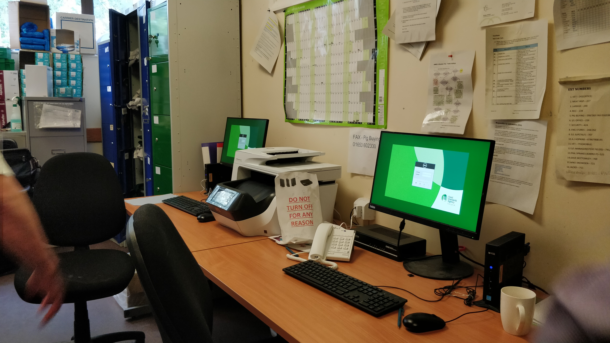
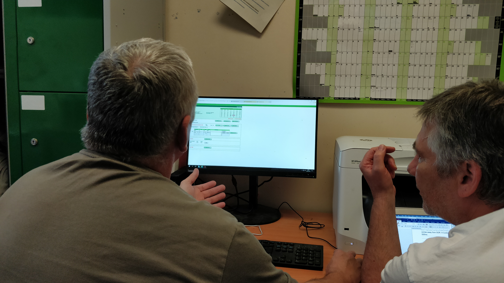

<h1>Intro</h1>

During discovery we visited 4 slaughterhouses and conducted face-to-face interfiews with a range of permanent and contract Meat Hygiene Inspectors and Official Veterinarians.

<ul>
  <li><a href="#plant-a">Plant A</a></li>
  <li><a href="#plant-b">Plant B</a></li>
  <li><a href="#plant-c">Plant C</a></li>
  <li><a href="#plant-d">Plant D</a></li>

  
  </ul>

We also conducted telephone <a href="#itl">interviews with 7 ITLs</a> across a broad range of regions and experience levels.

A service mapping workshop with key members of the Revenue and Accounting Team to help us understand back office operations.

Based on initial discovery findings, all ~800 Field Ops workers were invited to share further insights in <a href="#surveys">structured surveys</a> based on the needs and pain points in their roles as staff, contractors or managers.

 

<table>
  
  <tr>
    <th>User segment</th>
    <th>Number of participants</th>
  </tr>
  <tr>
    <td>Meat Hygiene Inspector (Perm)</td>
    <td>3</td>
  </tr>
  <tr>
    <td>Meat Hygiene Inspector (Contract)</td>
    <td>4</td>
   </tr>
    <tr>
    <td>Official Veterinarian (Contract)</td>
    <td>5</td>
  </tr>
   </tr>
    <tr>
    <td>Inspection Team Leader (Perm)</td>
    <td>8</td>
  </tr>
   <tr>
    <td>Area Managers</td>
    <td>4</td>
  </tr>
    </tr>
    <tr>
    <td>Finance Team Members</td>
    <td>6</td>
  </tr>
  <tr>
    <td>Technology Team</td>
    <td>4</td>
  </tr>
     <tr>
    <td>Additional Stakeholders</td>
    <td>2</td>
  </tr>
     <tr>
  <td><b>TOTAL</b></td>
  <td><b>38</b></td>
  </tr>
  </table>

 

<h2 id="plant-a">Plant A</h2>

<b>Date:</b>&nbsp;&nbsp;&nbsp;29 August 2019

<b>Environment:</b>

<ul>
  <li>Processes 5000 pigs per day and 10,000 at its former peak</li>
   <li>2 x offices for FSA staff - a main office and a side office</li>
  </ul>

<b>Key observations:</b>

<ul>
  <li>Tend to complete timesheets at the end of the week or weekend as there is limited time during the working day</li>

<li>Daily activity is logged in the daybook. Some staff use the daybook as a memory aid to help them complete their weekly timesheet</li>

<li>Contractors must also send their timesheet information to their SDP, Eville & Jones</li>

<li>Correcting mistakes can be difficult as you have to request a manager to unlock the timesheet before you can edit</li>

<li>E&J contractors are issued with Nokia devices that are smaller than the Samsung devices issues by FSA</li>

<li>Learning and remembering the activity codes is difficult, especially as a new starter</li>

<li>When a wrong plant has been entered, you can’t make corrections </li>

<li>Several users are making regular use of the ‘copy day’ feature</li>
  </ul>

<b>Photographs:</b>

Team workspace

  

Employee inputting timesheet with our User Researcher

 

<h2 id="plant-b">Plant B</h2>

<b>Date:</b>&nbsp;&nbsp;&nbsp;4 September 2019

<b>Environment:</b>

<ul>
  <li>Processes 250 cattle per day</li>
   <li>Small office with single desk with 1 x thin client and 1 x laptop</li>
  <li>Storage shelf with inspection kit</li>
  <li>Whiteboard with year planner, activity code summary, issues etc</li>
  <li>Paper notes and guidance on processes</li>
  </ul>

<b>Key observations:</b>

<ul>
 <li>G code activities are tied to individual plants and hours logged to G code activities tend to be the same most days for workers at that plant </li>
  <li>There is a lot of mental maths involved in completing the timesheet</li>
<li>There are often connectivity issues making it difficult to log into the thin client to complete a timesheet</li>
<li>Days that are out of the norm are difficult to log - for example, away days require many activity codes to be entered </li>
  <li>Contractors don’t have full access to the system and it can make them feel untrusted</li>
<li>The thin client storage is wiped once per day, meaning contractors must send PDF timesheets to E&J on the same day they are generated</li>
<li>For workers who travel between sites, they often maintain their own log in a diary or their phone to aid their memory when completing the timesheet at the end of the week</li>
<li>Workers must have a good knowledge of the SOR agreed hours as the system does not know these and they can change quite regularly </li>
  </ul>
 
<h2 id="plant-c">Plant C</h2>

<b>Date:</b>&nbsp;&nbsp;&nbsp;4 September 2019

<b>Environment:</b>

<ul>
  <li>Processes 377,000 chickens per day across 2 lines</li>
   <li>Medium sized office with 2 desks and 2 thin clients</li>
  <li>OV and MHI working in the same room at same time</li>
  <li>Whiteboards, printed materials, SOR on wall, year planner</li>
  <li>Inspection kit, boots, lockers</li>
  </ul>

<b>Key observations:</b>

<ul>
  <li>Most workers at this site complete their timesheet on a Monday for the previous week</li>
<li>Workers make regular use of the ‘copy a day’ feature and just make minor adjustments thereafter</li>
  <li>A timesheet takes around 15 minutes to complete</li>
<li>Some workers are using the ‘create a PDF’ feature to view a summary of all of their data to sense check before submission</li>
<li>There is an appetite for mobile access to complete the timesheet at home or while on the move</li>
<li>There are only a limited number of IP addresses which get taken quickly, making thin client access very unreliable</li>
  <li>The UI is cramped and difficult to see </li>
  <li>Workers believe there are too many codes to remember </li>
<li>Timesheets are locked once sent to a manager meaning workers must contact their manager to release it before they can correct any errors they identify after submission</li>
  </ul>
 

<h2 id="plant-d">Plant D</h2>

<b>Date:</b>&nbsp;&nbsp;&nbsp;4 September 2019

<b>Environment:</b>

<ul>
  <li>Tiny room with 2 x desks and 2 x thin clients</li>
   <li>Whiteboards, paper notes and guidance</li>
  <li>Very little space</li>
  </ul>

<b>Key observations:</b>

<ul>
<li>When working across multiple sites, it’s difficult to remember which G codes apply to which sites </li>
<li>There are no notifications when your timesheet is declined. Workers are reliant on their managers contacted them informally. The appetite is for text message</li>
  <li>Adding break hours is overly complex</li>
  <li>Most workers complete their timesheet on a Monday for the previous week</li>
<li>While all workers use the day book, those who travel between sites use their own diary or phone to note their hours each day</li>
  <li>Both workers would like to be able to access the system on a mobile phone while on the move</li>
  <li>The system is prone to crashing</li>
  </ul>
   
  <h2 id="itl">ITL telephone interviews</h2>
  
<b>Date:</b>&nbsp;&nbsp;&nbsp;6 September 2019

  
<b>Key observations:</b>

  <ul>
  <li>The data is spread across far too many screens - ITLs would like a single view for one worker. Too many clicks and scrolls!</li>

<li>When ITLs view breakdown, they see all activities for that worker including sites that aren’t under their remit. While this is useful, they'd like to see only workers in their jurisdiction while reviewing timesheets</li>

<li>The system doesn’t provide notifications so ITLs have to manually communicate with workers to let them know the timesheet is declined</li>
  
<li>The system doesn’t tell ITLs when a worker has re-submitted their declined timesheet. They have to communicate this informally via email or phone which is time consuming</li>

 <li>The review process is very time consuming because ITLs have to review every single worker</li>

<li>The system does not consider the SOR or a worker’s contract meaning all of the cross-checking is manual. One ITL had created their own spreadsheet to cross-check this automatically.</li>

<li>ITLs can’t access the system on a mobile phone or tablet when in the field</li>
  </ul>
<h2 id="surveys">Surveys</h2>
<h3>Timesheet Inputters (Permanent staff)</h3>
<ul>
  <li>The majority of respondents (61%) complete their timesheet at work </li>
<li>87% of respondents log their daily activity outside of the official process either in their phone or in a diary or notebook</li>
  <li>81% of respondents spend less than 1 hour per week completing their timesheet</li>
  <li>Only 18% of respondents would like to use a mobile device to complete their timesheet</li>
  <li>Only around 1/4 of respondents believe pre-filled timesheets using SOR, rota or contract data would be helpful (27%) or save them time (27%)</li>

<li>There is an appetite for notifications of timesheet progression by email (40%), within the timesheeting app (29%) and by text message (24%)</li>

  </ul>
   
  <h3>Timesheet Inputters (Contract staff)</h3>
 <ul>
 <li>65% of respondents log their daily activity outside of the official process either in their phone or in a diary or notebook</li>

<li>The majority of respondents (88%) spend less than 1 hour per week completing their timesheet</li>

  <li>25% of respondents have an appetite to use a mobile device to complete their timesheet</li>

<li>Over half the respondents believe a pre-populated timesheet from the SOR, rota and contract data would save them time</li>
  
<li>Over half (52%) of respondents would like to receive notification of timesheet progression via email</li> 

<li>Only 38% of respondents believe sending data to the SDP at the same time as the FSA would save them time or effort</li>
  </ul>
   
    <h3>Timesheet Managers</h3>
   <ul>
  <li>The majority of respondents manage timesheets weekly and in the workplace (87%)</li>

<li>The majority of respondents would like to would find it “helpful” for the system to compare timesheet entries against SOR and contract data (74%)</li>

<li>56% spend 3-4 hours per week reviewing timesheets
Email is the most popular proposed method of notification (82%), followed by notification within the timesheet system itself (43%)</li>

  <li>There is an appetite for notifications, in particular around:</li>

<ul>
  <li>Telling a team member when a timesheet was declined (95%)</li>
  <li>Telling the ITL a declined timesheet has been re-submitted (82%)</li>
  <li>Telling an ITL when a team member’s timesheet is late (82%)</li>
  </ul>
  </ul>

