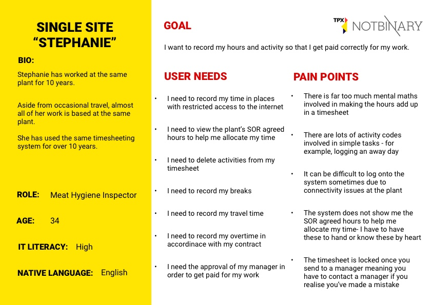
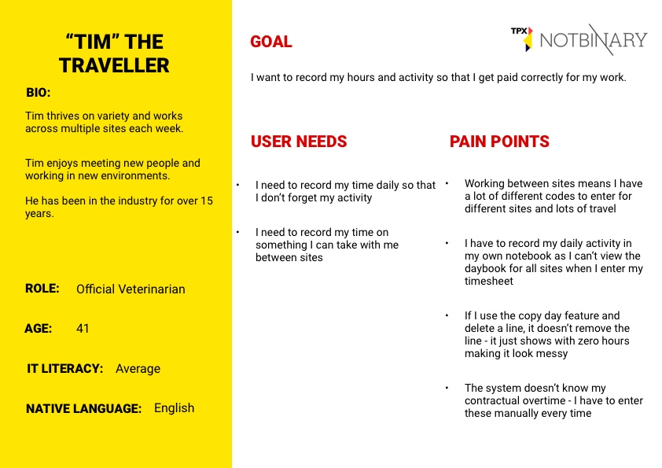
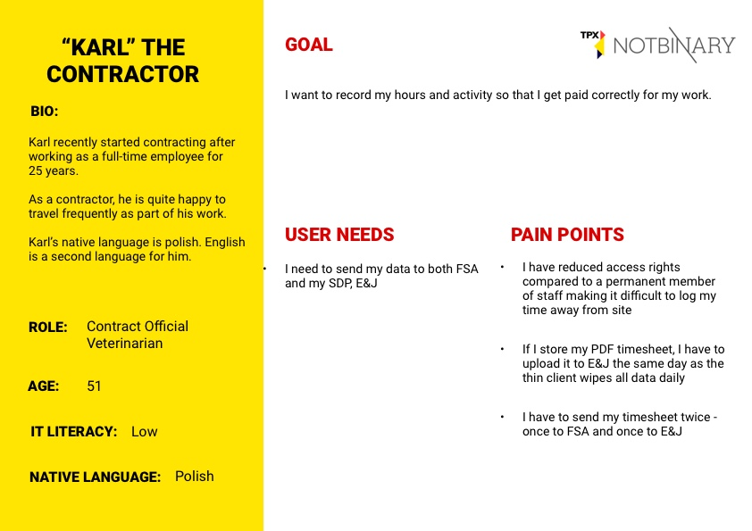
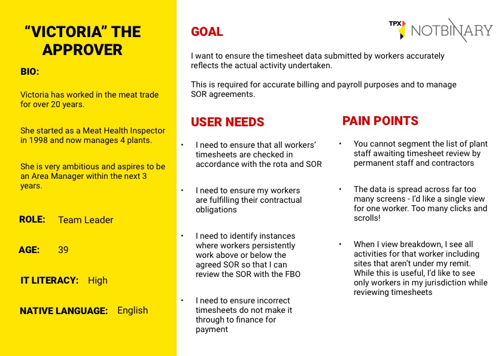

<h1>Personas</h1>

After undertaking the discovery research, we grouped users by common needs and pain points into a set of user personas:

<b>Timesheet Inputters</b>

<ul>
  <li>Single Site "Stephanie"</li>
  <li>"Tim" the Traveller</li>
  <li>"Karl" the Contractor</li>
  </ul>
  
<b>Timesheet Managers</b>

  <ul>
  <li>"Victoria" the Approver</li>
  </ul>
  
  <h2>Single Site "Stephanie"</h2>
  
  
  
  
<a href="uploads/single-site-stephanie.pdf" target="_blank">Download persona (PDF)</a>
  
  <h2>"Tim" the Traveller"</h2>
  
  
  
   
<a href="uploads/tim-the-traveller.pdf" target="_blank">Download persona (PDF)</a>

  
  <h2>"Karl" the Contractor</h2>
  
  
  
 
<a href="uploads/karl-the-contractor.pdf" target="_blank">Download persona (PDF)</a>

  
 <h2>"Victoria" the Approver</h2>
 
 
 
 
<a href="uploads/victoria-the-approver.pdf" target="_blank">Download persona (PDF)</a>

 
 