A retrospective is a ceremony held by an agile team at the end of each sprint to openly discuss what is going well and what needs improvement. It's a key activity to help the team iteratively improve their working culture. 
# General actions
- **Sprint Planning:** agree clear sprint goal, make time (30 mins) to plan own activities, in addition to group planning (30 mins). The drivers here are creating space for reflection, and aligning individual workstrems with teamgoals. 
- **Standups:** focus on key activities for the day, including how they contribute towards sprint goal. 
- **Stand-downs.** Schedule daily for 5:15/5:30 to share progress and findings. 
- Use shared **team calendar** to improve coordination of meetings with users, subject matter experts and other stakeholders.
- Improve visibility of the **Notbinary/FSA roadmap**. 

# Discovery Sprint 1 (19 Aug 2019 - 23 Aug)
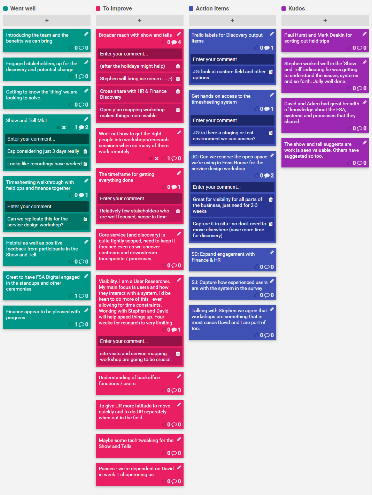

# Discovery 2 (27 Aug - 30 Aug)

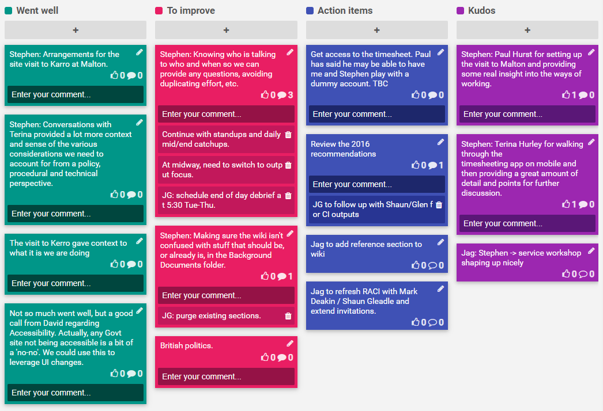

# Discovery 3 (2 Sep - 6 Sep)

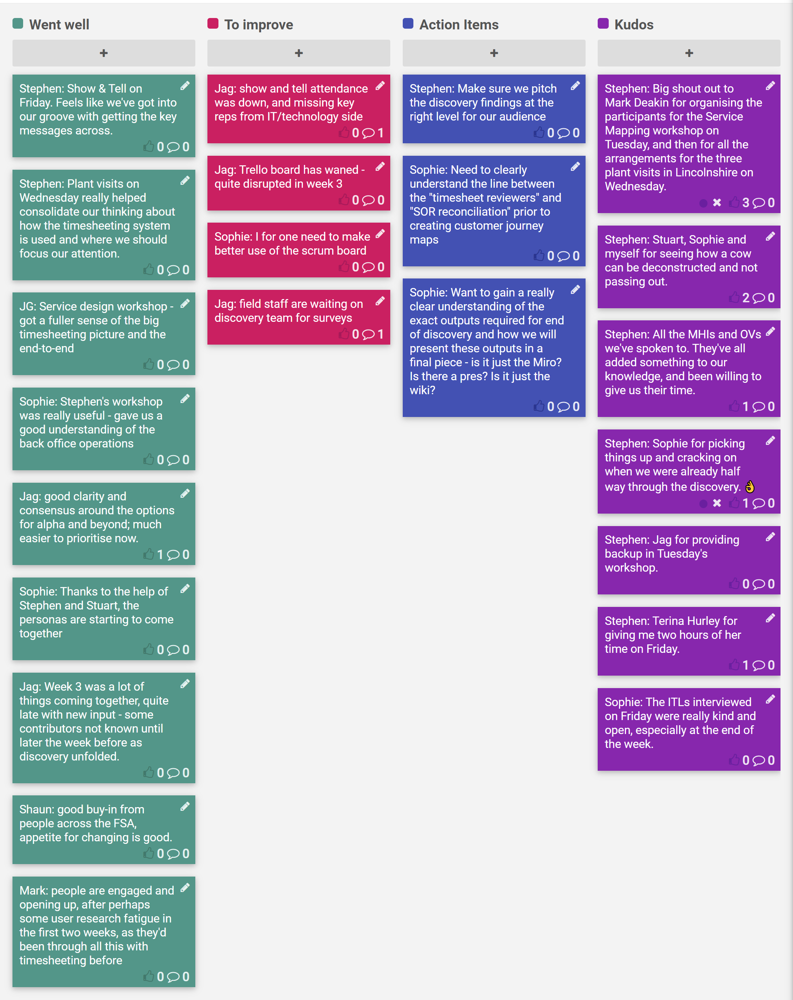

# Discovery 4 (9 Sep - 13 Sep)

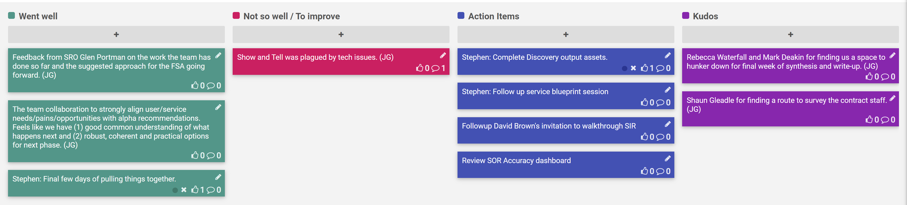

# Discovery 5 (16 Sep - 20 Sep)
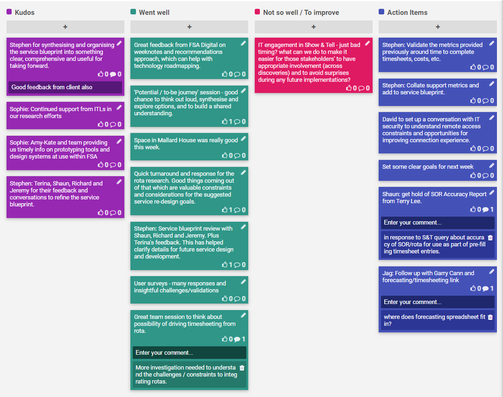

# Discovery 6 (23 Sep - 27 Sep)
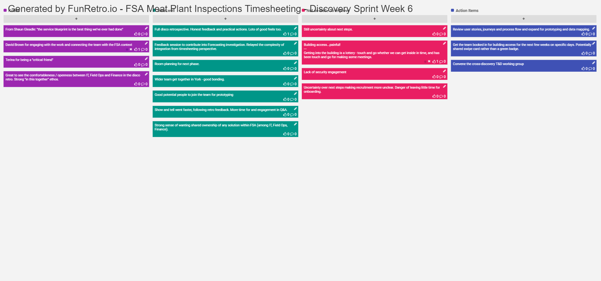

# Discovery 1-6
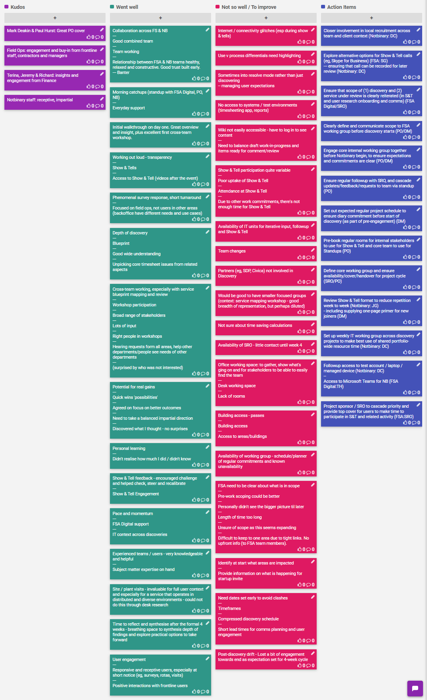
 
# Discovery 7 / Prototyping 1 (30 Sep - 4 Oct)
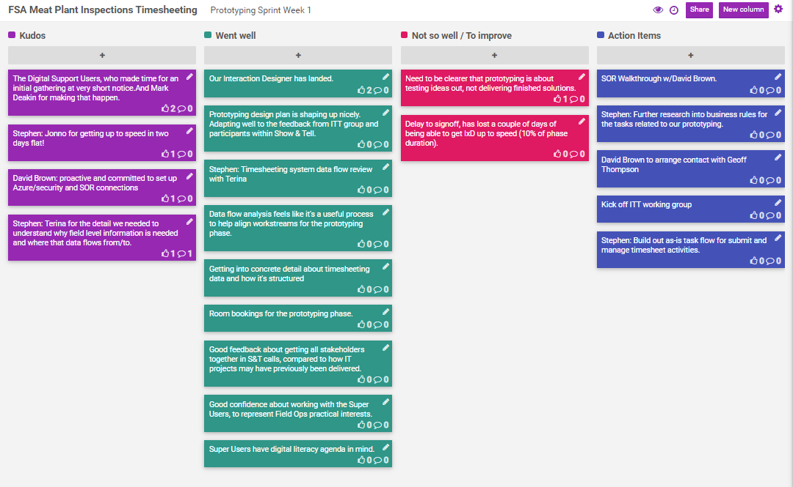

# Discovery 8 / Prototyping 2 (7-11 Oct)
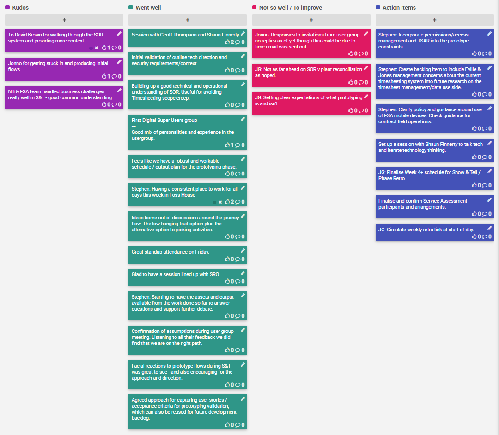

# Discovery 9 / Prototyping 3 (14-18 Oct)
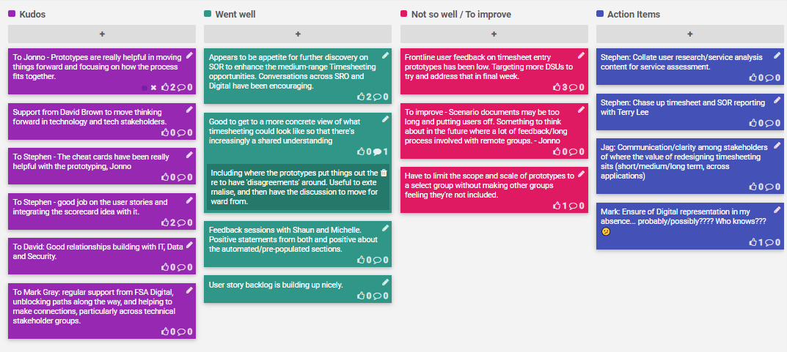

# Full Discovery Retrospective
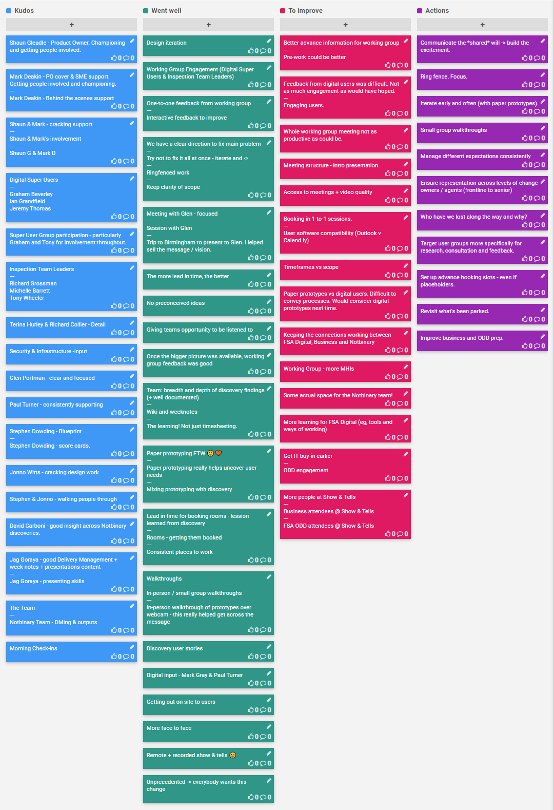
