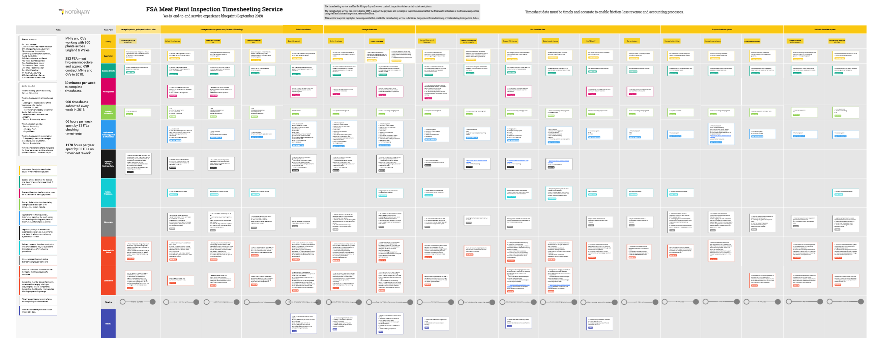

## Meat Plant Inspection Timesheeting Service Blueprint (Sept 2019)

Click to open and zoom: [fsa_timesheeting_service_experience_2019_09_19.pdf](uploads/fsa_timesheeting_service_experience_2019_09_19.pdf)

## Understand the service blueprint
The blueprint provides a consolidated view of the timesheeting service, showing the lifecycle of timesheet information in relation to meat plant inspections. It is organised around a number of high-level activities that cover defining, implementing, managing and using the timesheeting application and using the data that it helps to capture. 

The blueprint highlights the components of the timesheeting service. These are the policy, people and technology factors that enable it to support the business goals.  (payment for and recovery of costs relating to inspection duties).

Each activity includes a brief summary and a break down of the factors that need to be considered in designing, developing, managing and improving the end-to-end service.

The activities shown at each stage of the lifecycle can be mapped to user journeys and stories that step through more defined tasks and actions.

## Using the service blueprint

The blueprint is intended to be a central reference for anyone working on any of the service components so that business goals, user needs, constraints and dependencies can be managed effectively and not in isolation. The audience includes service designers, business analysts, technical architects, user researchers and user experience designers.

The blueprint can be read:
- **vertically** - each column provides a summary of a stage in the timesheeting lifecycle; the high-level processes that either directly use the timesheeting application or the data that it captures; and the factors that inform how those processes are completed. 
- **horizontally** - each row provides a themed view of the components that inform how the service is delivered.

## Maintaining the service blueprint
This blueprint shows the as-is timesheeting service at the time of Discovery in September 2019.
It will be retained for future reference; further iterations of the blueprint should be created as and when the service evolves.

## Related information
[Service goals](/service-overview#goals)
[Service constraints](/service-constraints)