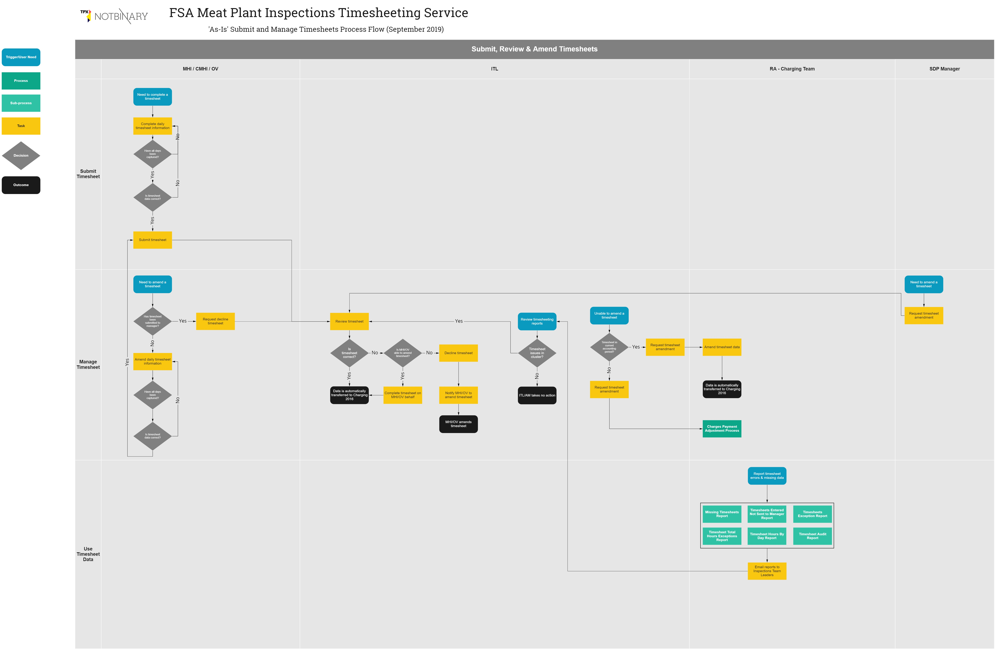

## Understand the service process flow

The process flow shows the sequence of processes and procedures that deliver the timesheeting service; and the relationship between it and other business processes. The diagram relates to the timesheeting user stories.

- Blue boxes represent user needs and/or other triggers.
- Green boxes represent processes or sub-processes that may comprise a number of procedures.
- Yellow boxes represent procedures, or parts of the user journey, that contain a number of detailed tasks and steps.
- Grey diamonds represent decision points. These will usually be determined by policy, business or system rules.
- Black boxes represent the end of the process. They should show a clear outcome.

### Submit and Manage Timesheets
The flow diagram focusses on the parts of the timesheeting service that cover submitting and managing timesheets. This includes submitting, reviewing and amending timesheets. Sub-processes that provide information to complete those tasks are shown.  

The diagram does not include downstream processes that use timesheet data for charging or payment processing, or using timesheet information to maintain Statements of Resource.

Click to open and zoom: [fsa_timesheeting_service_process_flow_2019_10_02.pdf](uploads/fsa_timesheeting_service_process_flow_2019_10_02.pdf)

