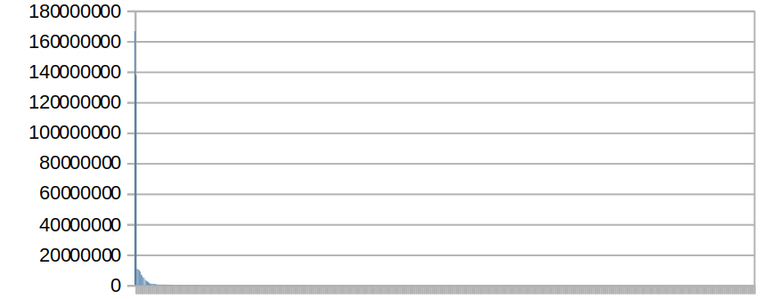
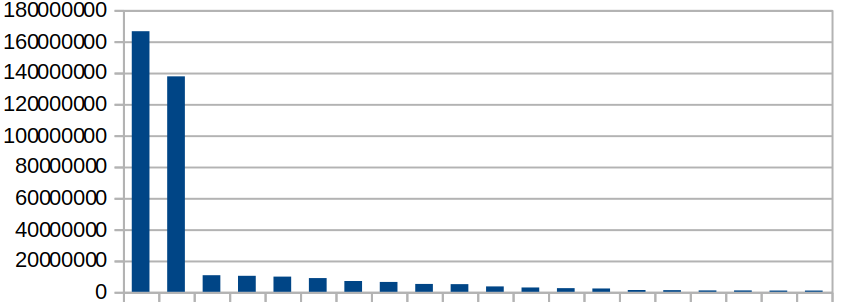
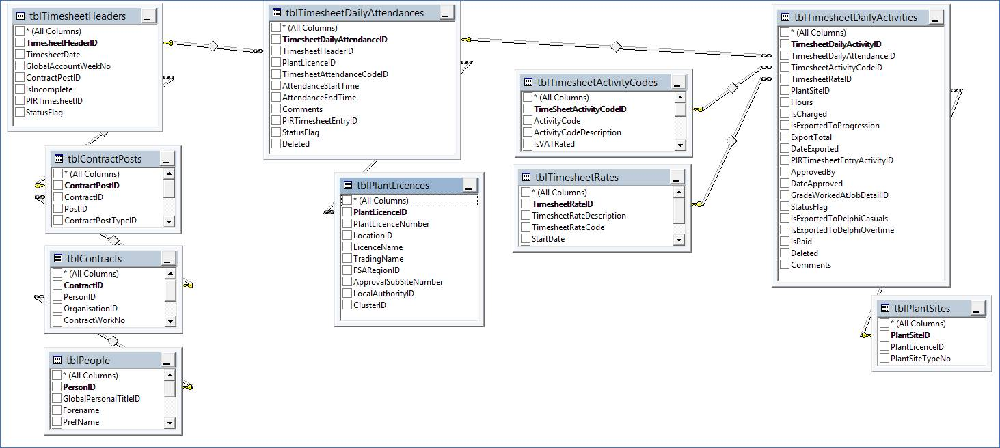

This page provides an overview of timesheeting as implemented in SIR.

## SIR Summary

The overall SIR database contains 400m rows. Of the total number of rows, 90% are in 8 tables and three of those tables relate to Timesheeting:

 * tblGlobalAuditLog
 * **tblTimesheetAuditLogIndex**
 * **tblTimesheetsAuthorisedBy**
 * tblObjectAuditArguments
 * tblglobalAuditLogSave
 * **tblTimesheetDailyActivities**
 * tblPaymentsDataHistory
 * tblGlobalErrorLog

### Row count distribution

The following chart shows the distribution of row-counts across tables in the database, illustrating that the bulk of rows are in a small subset of the database tables:

Taking the top 20 tables by row count helps to show the distribution more clearly - i.e. the number of rows in the top two tables significantly outnumbers the rows in all other tables:

### Unused tables

According to the BDO SIR Report, 234 of 615 tables (38%) are believed to be unused. The unused tables contain a total of 11m rows (or 2.8% of the total row-count).

## Timesheeting tables

 * There are 169m rows relating to timesheeting (168783289) across 37 tables (18 of a total of 55 timesheeting tables are believed to be unused)
 * In total the 55 timesheeting-related tables contain 171m rows (171212405) or 43% of all SIR table rows
 * 2.4m rows are in tables believed to be unused (2429116)
 * The **tblTimesheetAuditLogIndex** table alone accounts for 34% of all rows in SIR at 138m rows (137560155) and is the second-largest table in the database after **tblGlobalAuditLog**
 * Timesheeting rows for in-use tables (and excluding **tblTimesheetAuditLogIndex**) account for 7.9% of all rows in SIR
 * There are 90K rows in **tblAuthorisedTimesheetChanges** (90426). Based on 15 years, this indicates 500 rows per month (180 months) which may be indicative of the level of rework required to achieve accurate charging

The following diagram illustrates the core timesheeting tables, plus supporting reference tables from SIR. This illustrates that Plants/Sites and People/Contracts are key supporting areas of SIR for Timesheeting:

