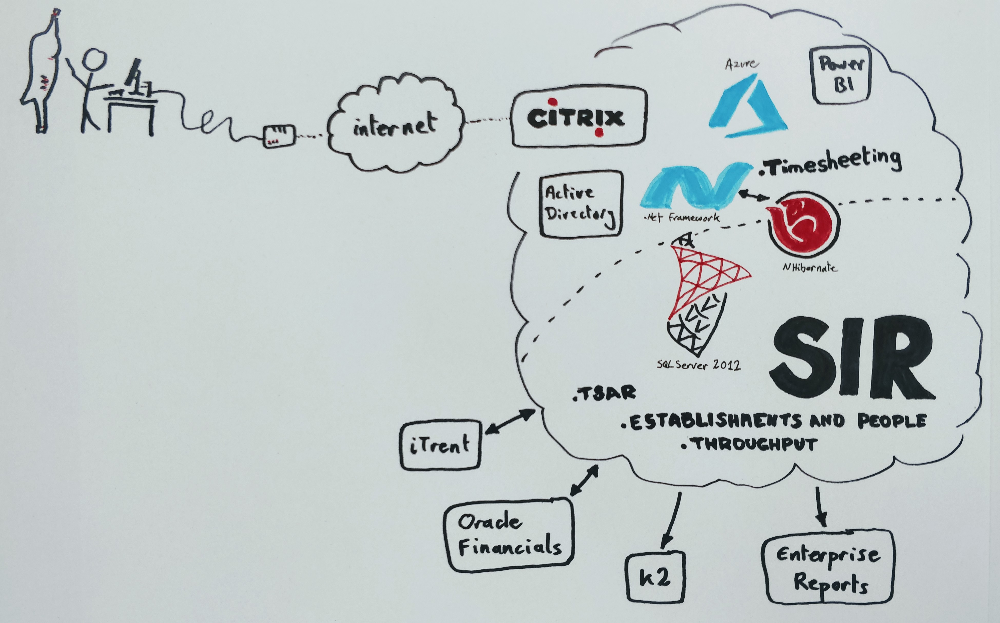

## Key systems

The following systems are core to supporting timesheeting, billing FBOs, paying contractors and paying staff overtime.

### Timesheet system
The timesheeting system is an FSA-owned bespoke application, supported and maintained by Civica. The application has been in use since 2007 and is a key area to be reviewed and updated for Field Operations. 

The system broadly works in terms of enabling billing and payments, however it is impractical for front-line staff to use in plants, difficult for inspectors to enter correct data and time-consuming for managers to achieve 100% checks for accuracy.

The current user experience results in inaccurate data entry, particularly for new members of staff learning to use the system, and is time consuming for ITLs to perform thourough checks to ensure recorded time is accurate. This puts both accuracy and timeliness at risk, which leads to downstream issues with invoice non-payment and challenges from FBOs.

The system is implemented as a .net framework application with NHibernate for object-relational mapping into tables in the SIR database (SQL Server 2012). The timesheeting application has been migrated to Azure Virtual Machines and some improvements have been made over the years. Users report that application response times are slow.

In order to access the system, staff in plants use Dell Wyse thin clients and Citrix. The quality of internet connectivity varies widely between plants and the performance and availability of the remote connection creates substantial friction in accessing timesheeting in addition to application performance. Users report that on some days they log on and then leave the terminal unattended whilst they go and make a cup of tea to wait for it to be ready to use.

### TSAR

The Timesheeting Access Register provides user permissions for accessing the Timesheeting application, including filtering the list of codes presented to users, based on their job role. Reducing the number of codes that users have to choose from provided a significant improvement in accuracy of timesheet entry. This indicates that further improvements in user experience would further benefit downstream back-office processes.

### Establishments and People

Holds user details for contractors (details of staff are held in iTrent). Also holds information about plants that inspectors work in.

### Finance system

FBO invoicing, contractor self-billing and employee overtime payments are handled through the FSA corporate finance system. This includes the Single Operating Platform (SOP), which is a Government shared-service Oracle implementation, plus related applications and processes.

### iTrent / iHR

The FSA HR system provides both a source of user account information and a destination for overtime payments due to staff, which are then processed through payroll.

## System context

The following image summarises key aspects of the timesheeting system context. It is not intended to be exhaustive, but rather to highlight specific areas and to provide an indicative overview.

This image illustrates that the context around the timesheeting application itself includes:
 * the device(s) inspection teams use to enter timesheets
 * internet connectivity
 * remote access requirements via citrix
 * multiple sets of back-end application tables hosted in the SIR database
 * interfaces to other FSA business systems, including iTrent, SOP and K2 (e.g. for Statement of Requirement).

## Pain points and opportunities

The following technical areas have been identified as candidates for relieving pain and/oc delivering value. These are in addition to redesigning the user experience for timesheet entry, approval and reconciliation:

 * **Internet connectivity**: If it is not practical to improve fixed-line connections in plants, internet access via mobile device is likely to be a viable alternative. However, not all plants are sitated in areas that have mobile coverage, so there is a need for offline sync capability.
 * **Remote access**: Reaching the timesheet application can be challenging. Users report slow logins (sometimes 3 or more minutes) during which time the terminal shows either a blank screen, or is loading applications such as Skype for Business, which users report as not serving a purpose for them. If remote access requirements can be removed in favour of an appropriate means to authenticate user access to timesheeting from outside the FSA network, users' experience of accessing timesheeting would be significantly improved. *Removing remote access into the FSA network would deliver sudstantial efficiency value*.
 * **Application performance**: Users report that, once they reach the timesheeting application, it is "slow to use". This could potentially be due to SQL query performance or NHibernate configuration. *Analysing the as-is application to identify and resolve performance bottlenecks could deliver quick-win efficiency gains*.
 * **NHibernate**: The timesheeting application makes significant use of the NHibernate object-relational mapping framework. Indications are that a significant amount of the complexity in the current code is at this level. *If a new timesheeting user experience is developed to integrate with the existing SIR database, it is likely that effort will be required to understand and reverse-engineer the current use of NHibernate*.
 * **SIR Database**: The Single Information Repository database hosts relational table storage for a number of applications (including timesheeting) in SQL Server 2012. Applying (micro)service architecture principles, this design means that service boundaries are porous, exposing internal implementation to other applications. Indications are that this has led to direct usage of database tables across applications. Effort needs to be invested to factor out these "undeclared dependencies" and create clear boundaries, whilst maintaining business-as-usual operations. *Moving to clean API boundaries is important not only for timesheets, but also for modernisation and sustainability of systems that underpin FSA operations*.
 * **Interfaces to HR and Finance systems**: Discovery work is underway to look into the future of these core business capabilities. If iTrent and Oracle Financials are replaced with different products, care should be taken to understand how this affects the current interfaces with timesheeting. *Ensure that any change of HR & Finance systems provides for an automated interface with timesheeting*.
 * **Reporting**: As Power BI is increasingly used in the organisation, consideration should be given in any replacement timesheeting system to ensuring that the ability to report continues to be supported, and further improves. *Ensure that any new timesheeting solution is readily accessible by, and conducive to, Power BI reporting.*
 