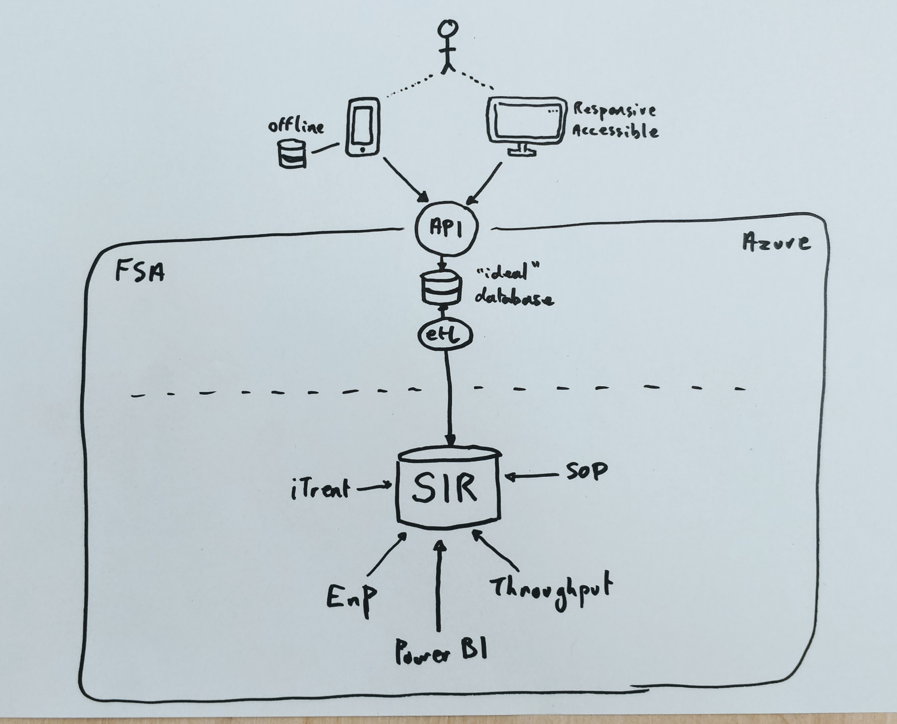
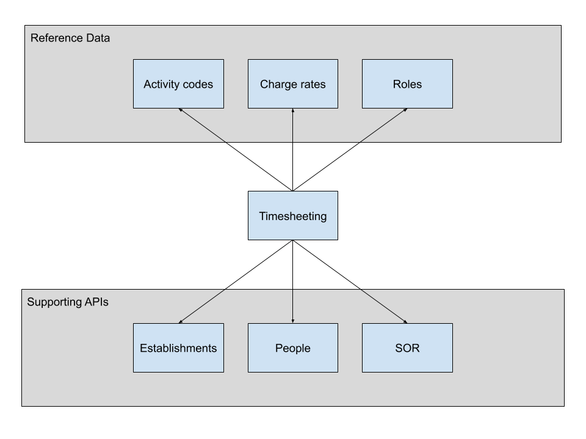

This page sets out key points to consider for timesheeting, based on the findings and evidence from the Discovery phase.

## Roadmap

A high-level roadmap for implementation of a new Timesheeting application to meet the needs indicated by the user research to date can be expected to include activity in the following areas:

 * A redesigned **user experience** (UX) for timesheet input, review and reconciliation to support accurate time recording and efficient review and reconciliation.
 * Integration of **additional data sources**, such as SOR, rota and employment contract data to enable the Timesheeting application to support accurate time entry and review, ideally by exception.
 * A **mobile version** of this user experience to enable users to record time when plant computers are unavailable, occupied by another inspector/OV, when they are on the road or when the plant Internet connection is unavailable.
 * **Offline synchronisation** capabiliy for mobile clients to enable users to record a timesheet in a timely manner, even when cellular connectivity is unavailable, and for this to be transmitted to FSA when signal becomes available.
 * Review and re-evaluation of the need for (and risks of) Citrix **remote connectivity** to the FSA network to access timesheeting, with a view to finding a solution that provides appropriate, authenticated user access to this specific application from staff, contractor and casual worker mobile devices.
 

## Timesheeting application options

The following sections explore implementation options for a new Timesheeting application, across three options: API-first web application, Microsoft PowerApps and implementation of an off-the-shelf product.

Whilst an API-first web application requires custom development, it can leverage the UK Government ecosystem, open standards and open source code libraries to provide much of the heavy lifting. Product implementation options require less custom development, but nonetheless require cost and effort to implement and maintain customisations over time.

Typically, making a good choice comes down to understanding where on the specific vs. commoditised axis the capabilities and features of the solution sit, and how closely the user experience needs to meet specific user needs. The more specific the capability, features or user needs, the more likely a custom solution is to meet requirements.

### API-first web application

The following diagram illustrates a typical API-first web application architecture that would support the needs of Timesheeting. 

A key benefit to this approach is that it provides the most flexibility to optimise the user experience to meet the needs of Timesheeting users. 

Key points to note here are:

 * Based on initial user research findings, timesheeting on a desktop machine is still required, however there is good indication that a mobile solution would be preferable for a significant number of users entering timesheets.
 * Internet connectivity (both fixed and cellular) is variable or, in some cases, unavailable. Providing for offline timesheet entry (e.g. a mobile device that synchronises when signal is available) would improve the both the experience and the timeliness of entry.
 * Desktop and mobile user interfaces would communicate with an API that provides a single point of implementation for Timesheeting application business logic.
 * Data would be written to a dedicated database, wholly owned and managed by the Timesheeting application (rather than a shared repository of tables as is currently the case with SIR). Access to this data wolud eventually be solely via the API, rather than by reading database tables across SIR.
 * In order to maintain current processes and service, an Extract Transform and Load (ETL) process would transfer timesheet data from the dedicated database to SIR, so ensuring that data continue to be made available in the existing format.

Modernising the timesheeting system is an opportunity to explore and shape patterns for how other applications that use SIR for database storage could be reworked, in service of deeper transformation and eventual decommissioning of SIR.

### Microsoft PowerApps

An alternative approach, currently being explored by Dairy Health Inspection is to use Microsoft PowerApps. 

This would create somewhat different architecture, cost and security considerations on the front end, principally that each inspector (whether permanent or contract) would need Office 365 access whilst working with FSA. 

This route raises cost and security points for allocation of licenses and reliable offboarding of contractors.

The back-end ETL process is still likely to be required in a similar form to populate SIR and maintain existing data flows.

### Off-the-shelf product

A further option for implementing timesheeting is to use an off-the-shelf solution. This option is attractive to the extent that timesheeting is a commoditised capability.

There are however two key points to take into account when considering implementation of an existing platform or solution:

 * **Specificity**: Whilst timesheeting as a concept appears to be something that many organisations do, plant inspection timesheeting appears to have needs specific to FSA, which could be difficult to implement in a generic product. For example, integration with TSAR for activity code filtering, or with SOR data to achieve timesheeting by exception.
 * **Back-end integration**: A timesheeting product would integration to SIR using the existing data formats and protocols.
 
The work required to implement, support and maintain both front-end customisation and back-end integration of an off-the-shelf timesheeting product is likely to be significant. It is also unlikely that a generic product would fully meet the needs of FSA timesheeting.

Given the right product, with the right level of customisation options and sufficient stability in the vendor roadmap for the product and its implementation options, these tradeoffs might still be acceptable.

## API-Led architecture

The current SIR implementation is, in effect, an API-led architecture. Timesheeting is able to access data it depends on, such as Establishments & People and reference data, such as Roles, Activity codes and Charge codes, via the SIR database. 

This architecture has proven itself to be effective for integration. However data contracts are defacto, being defined by the structure of internal application storage (database tables). This turns application-specific implementation details into an effective API, rather than having an agreed data structure.

Moving from a defacto to an explicit API would clearly identify dependencies between applications and allow these to evolve independently over time, enabling incremental change and continuous improvement without disruption to consuming systems. An explicit API-led approach would additionally enable reference data, such as activity codes and charge codes, to be managed by single authoritative source(s).

The following diagram outlines at a high level how timesheeting might look with explicit API dependencies. NB: APIs for SIR applications could start out as direct read-only translations of database tables in order to minimise initial time-to-value:

([original diagram here](https://docs.google.com/drawings/d/19FLaXBbKU0yKYljiUmLmP17H5GcFBa0uZGjUXV990yc))
