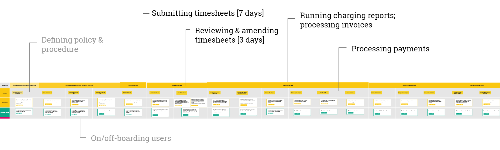
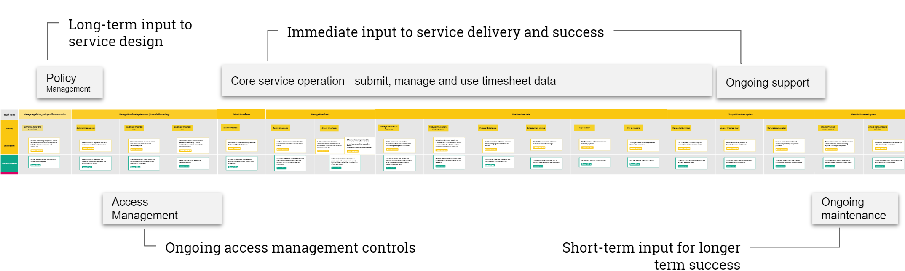
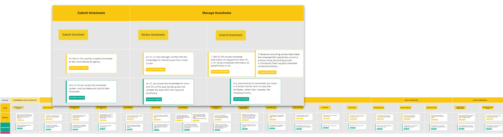

## Understand the service timeline

Not counting the time taken for the ongoing review and refinement of policy and procedure, the core timesheeting service operates within a 4-5 week, rolling accounting period. The accounting period is determined by Revenue Accounting processes and procedures. It ensures food business operators are charged, and service delivery partners and staff, are paid appropriately and in a timely manner.

Field operations tasks are concentrated in the first seven working days of each accounting period, with a further three days for review and revision before data is formally processed by Revenue Accounting systems.

The service timeline helps to focus on the activities most impacted by the timesheeting application itself and how they determine processes and data management downstream. The timeline helps align the user stories needed to reassess and redefine the way the timesheeting application is used to collect and deliver data.
 

---

### Service impact analysis
The impact analysis timeline highlights where there is an immediate impact from the timesheeting application on the overall success of the service.

 
  

  
### Application impact analysis
The application impact highlights the specific tasks around submitting and managing timesheets that impact the overall service. Improving the ways these tasks are completed could have a beneficial impact on what happens downstream.
 
 