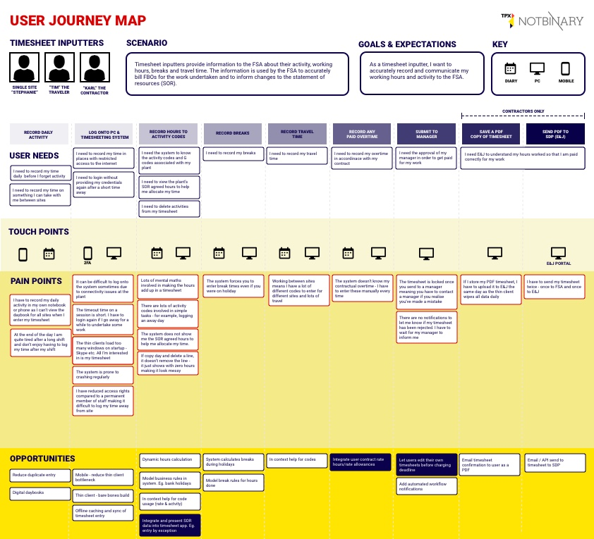
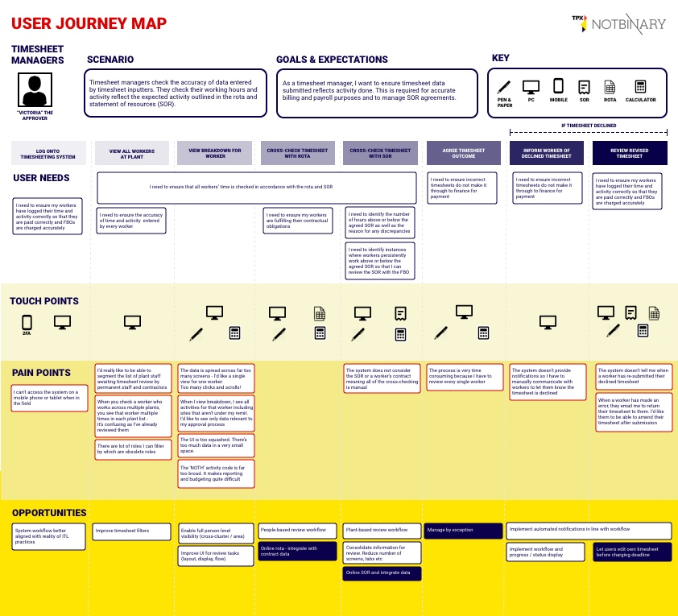

<h1>User journeys</h1>

After undertaking our discovery research, we created journey maps for our two main groups of users - timesheet inputters and timesheet managers.

The map details the journey users undertake along with their user needs, touch points and pain points. We have also outlined any opportunities for improvements.

<h2>Timesheet Inputters</h2>

<a href="uploads/timesheet-inputters-user-journey.pdf" target="_blank">Download User Journey (PDF)</a>

<h2>Timesheet Managers</h2>

<a href="uploads/timesheet-managers-user-journey.pdf" target="_blank">Download User Journey (PDF)</a>
